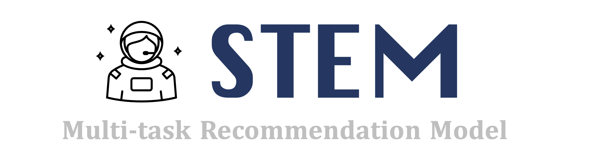

# STEM: Unleashing the Power of Embeddings for Multi-Task Recommendation


The open source code for "[STEM: Unleashing the Power of Embeddings for Multi-Task Recommendation](https://arxiv.org/abs/2308.13537)" presented at AAAI 2024.


🚧 **This code repository is under construction, please stay tuned!**
## Model Overview


## Getting Started
### Data Preparation
#### Tiktok 
Step 1. Please download the dataset ```final_track1_train.txt.tgz``` of IEEE ICME 2019 Grand Challenge Track 1 to the directory ```data/TiktokLarge/raw_data```. You can download the original dataset from [BaiduNetDisk](https://pan.baidu.com/s/1ktHIHVx6mJqKnZCNcvQ41w)(password:tk1c). Kindly be informed that the usage of this dataset is restricted to academic research purposes exclusively and it must not be utilized for any commercial or illegal activities. 

Step 2. Then, run the data preprocessing script as follows.
```sh
cd data/TiktokLarge
# Please put final_track1_train.txt under ./raw_data
# or modify the data set path in preprocess.py
python preprocess.py
```

### Reproduce Steps

In the next steps, we assume that the directory is ```src```.

#### Model and Dataset Configuration
We provided available model configuration file ```model_config.yaml``` and data configuration file ```dataset_config.yaml``` in the ```config``` directory. Please modify these two files according to your needs if necessary.

#### Reproduce the model performance
You can train a STEM model by running the following script.
```sh
python run_expid.py --expid STEM_TiktokLarge --config ./config --gpu 0 
```
For better performance, we provide the tuner to automatically search for optimal hyperparameters. For example, 
```sh 
# Please modify TiktokLarge_STEM_tuner.yaml to adjust the search space
python run_param_tuner.py --config ./config/tuner/TiktokLarge_STEM_tuner.yaml --gpu 0 1 
```
We also provide baseline implementations for comparing model performance. For example, 
```sh
# Shared-Bottom
python run_expid.py --expid SharedBottom_TiktokLarge --config ./config --gpu 0 
# MMoE
python run_expid.py --expid MMoE_TiktokLarge --config ./config --gpu 0 
# PLE
python run_expid.py --expid PLE_TiktokLarge --config ./config --gpu 0 
```

## Concat 
If you have any problem about this implementation, please create an issue or send us an Email at: 
- sulc21@mails.tsinghua.edu.cn (Liangcai Su)

## Citation

If you find our code or propcessed data helpful in your research, please kindly cite the following papers.
```bibtex
@article{AAAI24_STEM,
  author       = {Liangcai Su and
                  Junwei Pan and
                  Ximei Wang and
                  Xi Xiao and
                  Shijie Quan and
                  Xihua Chen and
                  Jie Jiang},
  title        = {{STEM:} Unleashing the Power of Embeddings for Multi-task Recommendation},
  journal={Proceedings of the 38-th AAAI Conference on Artificial Intelligence (AAAI 2024)}
  year         = {2024},
}
```


Our code is based on the FuxiCTR and BARS. 

> Jieming Zhu, Jinyang Liu, Shuai Yang, Qi Zhang, Xiuqiang He. [Open Benchmarking for Click-Through Rate Prediction](https://arxiv.org/abs/2009.05794). *The 30th ACM International Conference on Information and Knowledge Management (CIKM)*, 2021. [[Bibtex](https://dblp.org/rec/conf/cikm/ZhuLYZH21.html?view=bibtex)]

> Jieming Zhu, Quanyu Dai, Liangcai Su, Rong Ma, Jinyang Liu, Guohao Cai, Xi Xiao, Rui Zhang. [BARS: Towards Open Benchmarking for Recommender Systems](https://arxiv.org/abs/2205.09626). *The 45th International ACM SIGIR Conference on Research and Development in Information Retrieval (SIGIR)*, 2022. [[Bibtex](https://dblp.org/rec/conf/sigir/ZhuDSMLCXZ22.html?view=bibtex)]
